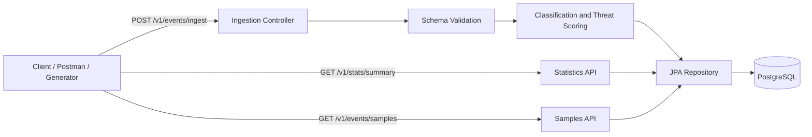

# Mini WSA – Security Analytics Pipeline

Mini WSA is a simplified security analytics backend inspired by large-scale Web Security Analytics systems.

The service ingests security events, validates and enriches them, persists them in PostgreSQL, and exposes analytical REST APIs for statistics and event samples.

## Technology Stack

* Java 21
* Spring Boot
* Maven
* PostgreSQL
* Flyway
* Docker Compose
* JUnit 5
* Testcontainers

## Completed Milestones

* `v0.1-ingestion` – event ingestion and validation
* `v0.2-enrichment` – classification and threat-score calculation
* `v0.3-stats` – summary statistics API
* `v0.4-samples` – event filtering and pagination
* `v0.5-generator` – security-event and attack-wave generator

## Project Status

Milestone `v0.1-ingestion` is complete: events are validated, persisted to PostgreSQL via Flyway-managed schema, and returned in the ingestion response.

Milestone `v0.2-enrichment` is complete: every accepted event is classified by attack type and assigned a threat score before being persisted; both are stored alongside the original event via the `V2__add_security_event_enrichment` migration (see [Enrichment](#enrichment)).

Milestone `v0.3-stats` is complete: `GET /v1/stats/summary` returns aggregate statistics — total events, per-category and per-action breakdowns, and top attackers/targeted paths — over a `receivedAt`-filtered time range (see [Statistics](#statistics)).

Milestone `v0.4-samples` is complete: `GET /v1/events/samples` returns paginated, filterable, enriched event records — filtered and sorted by the original event `timestamp` — with a database-computed total count (see [Samples](#samples)).

Milestone `v0.5-generator` is complete: a standalone command-line data generator produces realistic, wave-containing synthetic event datasets ready for `POST /v1/events/ingest`, with optional direct submission (see [Data Generator](#data-generator)).

## Architecture Overview

Mini WSA follows a layered Spring Boot architecture:



The main request flows are:

1. **Ingestion**

    * The controller accepts a single event or a batch.
    * Jakarta Bean Validation validates the request.
    * The service assigns `receivedAt`.
    * Classification and threat-score services enrich each event.
    * The complete batch is persisted in one transaction.

2. **Statistics**

    * PostgreSQL performs counts, averages, grouping, ordering, and top-10 limiting.
    * Matching entities are not loaded into memory for Java-side aggregation.
    * Time filtering uses `receivedAt`.

3. **Samples**

    * Optional filters are translated into JPA Specifications.
    * PostgreSQL performs filtering, sorting, counting, limit, and absolute offset.
    * Time filtering and sorting use the original event `timestamp`.

4. **Data Generator**

    * Runs as a standalone Java command-line application.
    * It does not start Spring Boot or require PostgreSQL for file generation.
    * Generated files can be submitted to the ingestion API directly or through built-in HTTP batching.

## Storage Choice

PostgreSQL was selected because it provides:

* ACID transactions for atomic batch ingestion
* a unique constraint for race-safe `eventId` enforcement
* efficient filtering and aggregation using SQL
* B-tree indexes for the statistics, samples, and repeat-offender access patterns
* mature Spring Data JPA and Testcontainers integration
* Flyway support for deterministic schema migrations

This is a practical choice for the assignment because the same storage engine supports both transactional ingestion and analytical queries without requiring additional infrastructure.

The main trade-off is that a single PostgreSQL database would not be the final architecture for a production system processing millions of events continuously. At significantly higher scale, the system would likely separate ingestion, stream processing, operational storage, and analytical storage.

## Build and Run

### Prerequisites

* Java 21
* Docker Desktop, or another running Docker environment

The project includes the Maven Wrapper, so a separate Maven installation is not required. Docker Compose starts PostgreSQL; the Spring Boot application is started separately through Maven.

### Windows PowerShell

Build the project:

```powershell
.\mvnw.cmd clean package
```

Run all tests:

```powershell
.\mvnw.cmd clean test
```

Start PostgreSQL and verify that it is healthy:

```powershell
docker compose up -d
docker compose ps
```

Run the application:

```powershell
.\mvnw.cmd spring-boot:run
```

Stop PostgreSQL:

```powershell
docker compose down
```

### Unix-like systems

Build the project:

```bash
./mvnw clean package
```

Run all tests:

```bash
./mvnw clean test
```

Start PostgreSQL and verify that it is healthy:

```bash
docker compose up -d
docker compose ps
```

Run the application:

```bash
./mvnw spring-boot:run
```

Stop PostgreSQL:

```bash
docker compose down
```

### Health check

Open:

```text
http://localhost:8080/actuator/health
```

Expected response:

```json
{
  "status": "UP"
}
```

## Event Ingestion

### `POST /v1/events/ingest`

Accepts either a single JSON security-event object or a JSON array of events — both are normalized internally to the same list and processed identically. Batch validation is **all-or-nothing**: if any event in the request fails validation, the entire request is rejected with `400 Bad Request` and no events are processed. On success, the server assigns a UTC `receivedAt` timestamp to every accepted event, persists the batch to PostgreSQL, and returns `201 Created`.

Batch persistence is also **all-or-nothing**: if any event in an already-validated batch fails to persist (for example, a duplicate `eventId`), the entire batch is rolled back and no events are stored.

Every accepted event is enriched with an attack classification and a threat score before it is persisted — see [Enrichment](#enrichment). Aggregate statistics over ingested events are available via `GET /v1/stats/summary` — see [Statistics](#statistics). Individual enriched events can be searched and paginated via `GET /v1/events/samples` — see [Samples](#samples).

#### Successful request

```powershell
curl.exe -X POST "http://localhost:8080/v1/events/ingest" `
  -H "Content-Type: application/json" `
  -d '{
    "eventId": "evt-001",
    "timestamp": "2026-07-11T10:15:30Z",
    "configId": 14227,
    "policyId": "policy-1",
    "clientIp": "203.0.113.10",
    "hostname": "example.com",
    "path": "/login",
    "method": "POST",
    "statusCode": 403,
    "userAgent": "Mozilla/5.0",
    "rule": { "id": "950001", "name": "SQL_INJECTION", "message": "SQL Injection Attack Detected", "severity": "CRITICAL", "category": "INJECTION" },
    "action": "DENY",
    "geoLocation": { "country": "US", "city": "San Francisco" },
    "requestSize": 512,
    "responseSize": 0
  }'
```

`201 Created`:

```json
{
  "acceptedCount": 1,
  "events": [
    { "eventId": "evt-001", "receivedAt": "2026-07-11T10:16:00Z" }
  ]
}
```

#### Invalid request

```powershell
curl.exe -X POST "http://localhost:8080/v1/events/ingest" `
  -H "Content-Type: application/json" `
  -d '{ "eventId": "evt-002" }'
```

`400 Bad Request`:

```json
{
  "status": 400,
  "error": "VALIDATION_FAILED",
  "path": "/v1/events/ingest",
  "violations": [
    { "field": "events[0].timestamp", "message": "must not be null" },
    { "field": "events[0].configId", "message": "must not be null" }
  ]
}
```

#### Duplicate event

```powershell
curl.exe -X POST "http://localhost:8080/v1/events/ingest" `
  -H "Content-Type: application/json" `
  -d '{ "eventId": "evt-001", ... }'
```

`409 Conflict` (when `eventId` already exists):

```json
{
  "status": 409,
  "error": "DUPLICATE_EVENT",
  "path": "/v1/events/ingest",
  "violations": [
    { "field": "eventId", "message": "One or more submitted event IDs already exist" }
  ]
}
```

## Persistence

* PostgreSQL is used to persist accepted security events; start it with `docker compose up -d` before running the application (see [Start PostgreSQL](#start-postgresql)).
* Flyway manages the schema (`src/main/resources/db/migration`); Hibernate runs with `ddl-auto: validate` and never generates DDL itself.
* Accepted events are flattened into a single `security_events` table — nested `rule` and `geoLocation` fields become columns, not related tables.

## Enrichment

Every accepted event is classified and scored before it is persisted; the resulting `attack_type` and `threat_score` columns (added by the `V2__add_security_event_enrichment` migration) are stored on the same `security_events` row as the original event.

### Attack classification

`attack_type` is derived directly from the event's `rule.category`:

| Category              | Attack type              |
|------------------------|---------------------------|
| `INJECTION`             | SQL/Command Injection     |
| `XSS`                   | Cross-Site Scripting      |
| `PROTOCOL_VIOLATION`    | Protocol Anomaly          |
| `DATA_LEAKAGE`          | Data Exfiltration         |
| `BOT`                   | Bot Activity              |
| `DOS`                   | Denial of Service         |
| `RATE_LIMIT`            | Rate Limiting             |

### Threat score

`threat_score` is a deterministic 0–100 value, the sum of:

* **Severity** — `CRITICAL` 40, `HIGH` 30, `MEDIUM` 20, `LOW` 10
* **Action** — `DENY` 20, `ALERT` 10, `MONITOR` 0
* **Sensitive path** — +15 if `path` contains `/admin` or `/login`
* **Repeat offender** — +15 if the event's `clientIp` is a repeat offender (see below)

The result is capped at 100, though the current rule set can reach at most 90 (`CRITICAL` + `DENY` + sensitive path + repeat offender).

### Provisional repeat-offender assumptions (pending assignment clarification)

* The window is `[event.timestamp - 10 minutes, event.timestamp]` (inclusive), keyed on the event's own `timestamp` field — **not** `receivedAt`.
* The event being scored counts toward its own total. A `clientIp` is a repeat offender once the total matching-event count — previously persisted rows plus earlier events in the same batch plus the event itself — **exceeds five** (i.e. the sixth and any later event in-window receive the bonus, not the first five).
* Within a batch, events are evaluated in `timestamp` ascending order (original request order breaks ties on equal timestamps), so "earlier" means earlier in that deterministic order, not the order events appeared in the request.
* Late/out-of-order events never trigger recalculation of already-persisted rows — threat scores are computed once, at ingestion time, and never rewritten.
* This is implemented as one `COUNT` query per event against the existing `(client_ip, event_timestamp)` index, which is acceptable at this assignment's scale but would not scale to high ingestion throughput; a production system would likely use keyed streaming state (e.g. Redis) instead.
* These are documented, easily reversible assumptions, not final design decisions.

## Statistics

### `GET /v1/stats/summary`

Returns aggregate statistics over ingested security events for a given time range.

| Query parameter | Required | Description |
|---|---|---|
| `from`     | Yes | ISO-8601 timestamp — inclusive lower bound of the range |
| `to`       | Yes | ISO-8601 timestamp — exclusive upper bound of the range |
| `configId` | No  | Restrict aggregation to a single configuration; omit to aggregate across all configurations |

The range is half-open, `[from, to)`: an event whose `receivedAt` equals `from` is included, an event whose `receivedAt` equals `to` is excluded. Filtering is always performed against the persisted `receivedAt` timestamp — the time the server accepted the event — not the original event `timestamp` field.

`from >= to`, and a missing or malformed `from`/`to`, are rejected with `400 Bad Request` using the same structured error shape as [Event Ingestion](#event-ingestion).

#### Successful request

```powershell
curl.exe "http://localhost:8080/v1/stats/summary?configId=14227&from=2026-07-01T00:00:00Z&to=2026-07-02T00:00:00Z"
```

`200 OK`:

```json
{
  "configId": 14227,
  "timeRange": {
    "from": "2026-07-01T00:00:00Z",
    "to": "2026-07-02T00:00:00Z"
  },
  "totalEvents": 1523,
  "byCategory": {
    "INJECTION": { "count": 450, "avgThreatScore": 72.3 }
  },
  "byAction": {
    "DENY": 890,
    "ALERT": 433,
    "MONITOR": 200
  },
  "topAttackers": [
    { "clientIp": "203.0.113.42", "count": 87, "avgThreatScore": 81.2 }
  ],
  "topTargetedPaths": [
    { "path": "/api/v1/login", "count": 234 }
  ]
}
```

* `byCategory` and `byAction` only contain entries for categories/actions with at least one matching event.
* `topAttackers` and `topTargetedPaths` are each capped at the top 10 results, ordered by event count descending (ties broken by `clientIp`/`path` ascending, respectively).
* When `configId` is omitted, the response's `configId` field is `null` and the aggregation spans every configuration.
* When no events match the query, the endpoint still returns `200 OK`, with `totalEvents: 0`, empty `byCategory`/`byAction` objects, and empty `topAttackers`/`topTargetedPaths` arrays.

## Samples

### `GET /v1/events/samples`

Returns individual enriched event records, filtered and paginated. All query parameters are optional.

| Query parameter | Description |
|---|---|
| `configId` | Restrict results to a single configuration; omit to search across all configurations |
| `from`     | ISO-8601 timestamp — inclusive lower bound, applied to the original event `timestamp` |
| `to`       | ISO-8601 timestamp — exclusive upper bound, applied to the original event `timestamp` |
| `category` | One of the `RuleCategory` enum values (e.g. `INJECTION`, `XSS`, `BOT`, ...) |
| `action`   | One of the `Action` enum values (`DENY`, `ALERT`, `MONITOR`) |
| `limit`    | Maximum number of results to return. Defaults to `20`; must be between `1` and `100` |
| `offset`   | Absolute number of matching rows to skip before the returned page. Defaults to `0`; must not be negative |

Filtering and sorting both use the original event `timestamp` field — the time the event occurred at the edge — not the server-assigned `receivedAt` timestamp used by [Statistics](#statistics). If both `from` and `to` are given, the range is half-open, `[from, to)`; if only one is given, only that bound is applied. `from >= to`, invalid `category`/`action` values, a malformed `from`/`to`, `limit` outside `[1, 100]`, and a negative `offset` are all rejected with `400 Bad Request`.

Results are sorted by event `timestamp` descending; ties are broken deterministically by database ID descending (most-recently-inserted first). `offset` is an absolute row offset (not a page number), so `limit=3&offset=2` always skips exactly 2 matching rows regardless of `limit`.

#### Successful request

```powershell
curl.exe "http://localhost:8080/v1/events/samples?configId=14227&category=INJECTION&action=DENY&limit=20&offset=0"
```

`200 OK`:

```json
{
  "totalCount": 1523,
  "limit": 20,
  "offset": 0,
  "events": [
    {
      "eventId": "evt-001",
      "timestamp": "2026-07-11T10:15:30Z",
      "configId": 14227,
      "policyId": "policy-1",
      "clientIp": "203.0.113.10",
      "hostname": "example.com",
      "path": "/login",
      "method": "POST",
      "statusCode": 403,
      "userAgent": "Mozilla/5.0",
      "rule": {
        "id": "950001",
        "name": "SQL_INJECTION",
        "message": "SQL Injection Attack Detected",
        "severity": "CRITICAL",
        "category": "INJECTION"
      },
      "action": "DENY",
      "geoLocation": { "country": "US", "city": "San Francisco" },
      "requestSize": 512,
      "responseSize": 0,
      "receivedAt": "2026-07-11T10:16:00Z",
      "attackType": "SQL/Command Injection",
      "threatScore": 75
    }
  ]
}
```

`totalCount` reflects the number of matching rows before pagination; `events` holds at most `limit` results starting at `offset`. When no events match, the endpoint still returns `200 OK` with `totalCount: 0` and an empty `events` array.

## Data Generator

A standalone command-line tool generates realistic, synthetic security events for load-testing and demoing the ingestion, enrichment, statistics, and samples APIs. It lives entirely inside this Maven project (`com.eitanroni.miniwsa.generator`) but is independent of the Spring Boot application: running it does **not** start the web server and does **not** require PostgreSQL, unless `--api-url` is supplied to submit the generated events to a running instance.

### Generated fields

Each generated event contains exactly the raw fields accepted by `POST /v1/events/ingest` — `eventId`, `timestamp`, `configId`, `policyId`, `clientIp`, `hostname`, `path`, `method`, `statusCode`, `userAgent`, `rule` (`id`, `name`, `message`, `severity`, `category`), `action`, `geoLocation` (`country`, `city`), `requestSize`, `responseSize`. It never generates `receivedAt`, `attackType`, `threatScore`, or a database ID — those are assigned by the application itself during ingestion and enrichment. Every `eventId` in a generated dataset is unique. Category, severity, action, status code, and path are kept loosely consistent (e.g. `RATE_LIMIT` events use status `429`; `DENY` actions favor `401`/`403`; `DATA_LEAKAGE` events have large response sizes).

### Attack waves

An approximate percentage of generated events (`--wave-percentage`, default `30`) belong to **attack waves**: bursts of `--wave-size` (default `10`, minimum `6`) events sharing the same `clientIp`, `path`, and rule category, with strictly non-decreasing timestamps clustered inside a randomly chosen window under 10 minutes. Waves make the generated dataset exercise repeat-offender enrichment, top attackers, top targeted paths, and category/action aggregation. The requested `--count` is always produced exactly, even when it isn't evenly divisible by `--wave-size` or is smaller than `--wave-size` — the leftover/undersized remainder is generated as ordinary background traffic instead of a wave.

Event timestamps are drawn from the previous 24 hours. The final list is **shuffled** before being written (a real ingestion batch would not arrive in perfect timestamp order); sort by `timestamp` yourself if chronological order is needed.

### Command-line options

| Option | Default | Description |
|---|---|---|
| `--count` | `1000` | Total number of events to generate; must be greater than `0` |
| `--output` | `generated-security-events.json` | Output JSON file path |
| `--seed` | derived from the current time | Random seed for reproducible generation |
| `--wave-percentage` | `30` | Approximate percentage of events belonging to attack waves, `0`-`100` |
| `--wave-size` | `10` | Events per attack wave; must be at least `6` |
| `--api-url` | none | Ingestion endpoint to submit to (e.g. `http://localhost:8080/v1/events/ingest`); omit to only write the file |
| `--batch-size` | `250` | Events per HTTP batch when `--api-url` is set; must be greater than `0` |
| `--id-prefix` | `gen-<resolved seed>` | Prefix for generated event IDs |
| `--help` | — | Print usage and exit |

Invalid arguments (out-of-range values, an unknown option, a missing option value) print an error and usage guidance to stderr, exit with a non-zero status, and never create a partial output file.

### Running the generator

The generator is wired into the build via `exec-maven-plugin`, but the plugin has no execution bound to any lifecycle phase, so it never runs during a normal `mvn compile`/`mvn test`/`spring-boot:run` — it only runs when `exec:java` is explicitly requested.

**File only, default options (Windows PowerShell):**

```powershell
.\mvnw.cmd -q -DskipTests compile exec:java -Pgenerator "-Dexec.args=--count 1000"
```

**File only, default options (Unix-like shell):**

```bash
./mvnw -q -DskipTests compile exec:java -Pgenerator -Dexec.args="--count 1000"
```

The `-Pgenerator` profile presets `exec.mainClass` to `com.eitanroni.miniwsa.generator.SecurityEventGeneratorMain`; without it, pass `-Dexec.mainClass=com.eitanroni.miniwsa.generator.SecurityEventGeneratorMain` explicitly instead.

**10,000-event dataset:**

```powershell
.\mvnw.cmd -q -DskipTests compile exec:java -Pgenerator "-Dexec.args=--count 10000 --seed 42 --output generated-security-events.json"
```

```text
Generated 10000 events
Attack-wave events: 3000
Output: generated-security-events.json
Seed: 42
```

**Deterministic seed**: the seed controls pseudo-random choices and the default generated ID prefix. Generator tests use a fixed `Clock` to verify fully deterministic output. The CLI uses the current time as the reference point for recent timestamps, so separate CLI runs with the same seed reproduce the same random structure and event IDs, but timestamp values may differ when the runs start at different times.

```powershell
.\mvnw.cmd -q -DskipTests compile exec:java -Pgenerator "-Dexec.args=--count 500 --seed 42 --id-prefix demo-run"
```

**Direct ingestion** (generates the file, then submits it in batches to a running application):

```powershell
.\mvnw.cmd -q -DskipTests compile exec:java -Pgenerator "-Dexec.args=--count 10000 --seed 42 --api-url http://localhost:8080/v1/events/ingest --batch-size 250"
```

```text
Submitted batch 1/40: 250 events
...
Submitted batch 40/40: 250 events
Submitted 10000 events successfully
```

A batch that receives a non-2xx response stops submission immediately (no retries) and reports the failed batch number, HTTP status, and response body; the process exits with a non-zero status. The output file remains available, but batches accepted before the failure may already be persisted. Resubmitting the entire file from the beginning can therefore return `409 Conflict` for previously accepted IDs. Recovery options include cleaning the test database, submitting only the remaining batches, or generating a new dataset with a different `--seed` or `--id-prefix`.

### Ingesting the generated file directly

The output file's top-level JSON array is exactly the request body `POST /v1/events/ingest` expects:

```bash
curl.exe -X POST \
  http://localhost:8080/v1/events/ingest \
  -H "Content-Type: application/json" \
  --data-binary @generated-security-events.json
```

On Windows PowerShell, use `curl.exe` (not the `curl` alias for `Invoke-WebRequest`):

```powershell
curl.exe -X POST `
  http://localhost:8080/v1/events/ingest `
  -H "Content-Type: application/json" `
  --data-binary "@generated-security-events.json"
```

**Duplicate-event warning**: every generated `eventId` is unique *within* a single generated file, but `eventId` is enforced unique at the database level (see [Persistence](#persistence)). Re-ingesting the same generated file a second time — or generating a new file with the same `--seed` and `--id-prefix` after already ingesting the first run — will fail the whole batch with `409 Conflict` (`DUPLICATE_EVENT`), since batch persistence is all-or-nothing. Use a different `--seed` and/or `--id-prefix` for each run you intend to ingest.

### Trade-offs

* The full dataset is held in memory as a `List` of request DTOs before being written; this is fine at the 10,000-event scale this milestone targets, but is not designed to scale to unbounded sizes.
* `--api-url` submission sends events in configurable batches (default `250`), never all at once, to keep individual request sizes and server-side transaction sizes reasonable.
* There is no automatic retry on a failed batch. Previously accepted batches may already be committed, so recovery must avoid resubmitting their event IDs.

## Testing Strategy

The test suite covers the system at several levels:

* **Unit tests**

    * attack classification
    * threat-score calculation
    * repeat-offender behavior
    * DTO and entity mapping
    * generator configuration and deterministic behavior

* **Controller tests**

    * successful requests
    * malformed JSON
    * validation failures
    * invalid query parameters
    * structured error responses

* **Service tests**

    * orchestration and response construction
    * batch behavior
    * statistics and samples mapping

* **PostgreSQL integration tests**

    * persistence and transaction rollback
    * duplicate-event handling
    * Flyway upgrades with existing data
    * statistics aggregations
    * dynamic samples filtering
    * sorting, total counts, limits, and arbitrary offsets

* **Generator tests**

    * exact event count
    * unique IDs
    * schema validity
    * attack-wave generation
    * JSON serialization
    * HTTP batch submission and failure behavior

At project completion, the full suite contained 167 passing tests with no failures, errors, or skipped tests.

## Implementation Assumptions

* In the incoming security-event schema, `city` (on `GeoLocationRequest`) and `userAgent` (on `SecurityEventRequest`) are optional; every other field is required.
* Batch ingestion uses all-or-nothing validation: if any event in a batch fails validation, the whole batch is rejected and the ingestion service is never invoked.
* Timestamps are represented as ISO-8601 strings on the wire and parsed into `java.time.Instant`.
* A single JSON object and a JSON array are both accepted by `POST /v1/events/ingest` and are normalized to the same internal list, so single-event requests report validation errors as `events[0].*`.

### Provisional persistence assumptions (pending assignment clarification)

* `eventId` is assumed unique and is enforced with a database unique constraint.
* A duplicate `eventId` currently returns `409 Conflict` with error code `DUPLICATE_EVENT`. This may change to idempotent (no-op success) behavior once the assignment clarification is available.
* Batch persistence is atomic and all-or-nothing: a failure while saving any single event in a batch rolls back the entire batch, and no partial batches are ever stored.
* These are documented, easily reversible assumptions, not final design decisions.

## Challenging Parts

### Repeat-offender semantics

The assignment does not fully define whether the current event counts toward the threshold or whether the ten-minute window uses the original event timestamp or `receivedAt`.

I handled this by selecting explicit, documented semantics, covering them with tests, and keeping the implementation isolated so the behavior can be changed without rewriting the ingestion flow.

### Atomic batch persistence and duplicates

A preliminary existence check would not be race-safe. The database unique constraint is therefore authoritative. Persistence is executed in one transaction, and the database constraint name is inspected to distinguish duplicate events from unrelated integrity failures.

### Dynamic optional filters

A static JPQL query using repeated `:parameter IS NULL OR ...` expressions was fragile with some PostgreSQL/Hibernate parameter types. The Samples API instead uses JPA Specifications so that predicates are created only for parameters that are actually supplied.

### Arbitrary offset pagination

Spring's normal page-number abstraction does not correctly represent every absolute offset. A custom `OffsetBasedPageable` preserves the requested offset directly, allowing requests such as `limit=3&offset=2` to skip exactly two matching rows.

### Flyway migration compatibility

The enrichment migration had to support databases that already contained V1 rows. The migration first introduced nullable columns, backfilled existing records, added constraints, and only then applied `NOT NULL`. A dedicated PostgreSQL integration test verifies the V1-to-V2 upgrade path.

## What I Would Improve with More Time

For a production-scale implementation, I would consider:

* introducing Kafka or another durable message broker between producers and processing
* moving repeat-offender detection to keyed streaming state using Flink, Kafka Streams, or a Redis-based time-window structure
* partitioning the events table by time and defining a retention policy
* using a dedicated analytical datastore for long-range and high-cardinality queries
* implementing idempotent ingestion instead of returning a conflict for every duplicate
* introducing a dead-letter queue for invalid or repeatedly failing events
* adding observability with metrics, tracing, dashboards, and structured logs
* adding authentication, authorization, and API rate limiting
* supporting resumable generator submission after a partially successful batch run
* adding the optional time-series statistics endpoint
* running the application itself through Docker Compose in addition to PostgreSQL